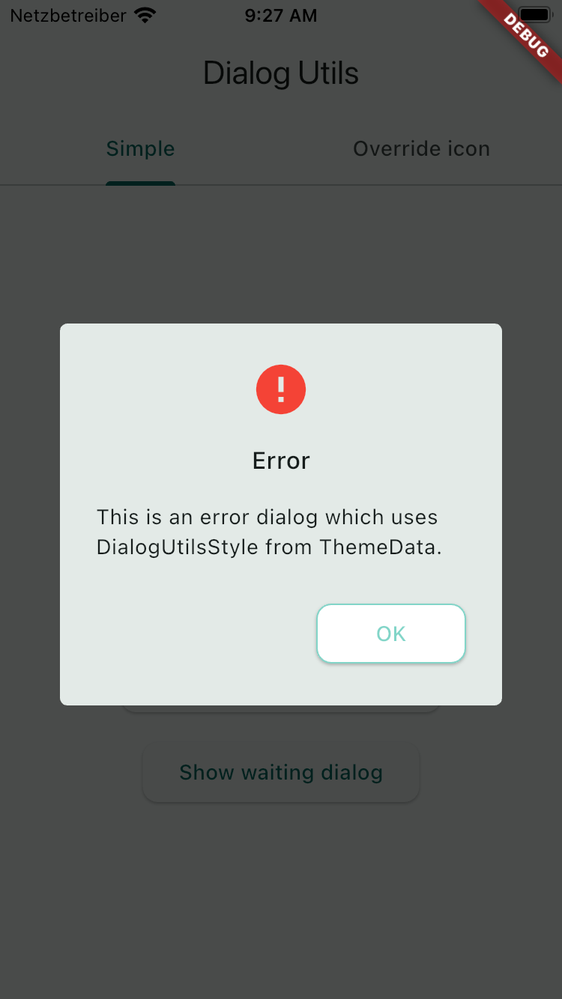
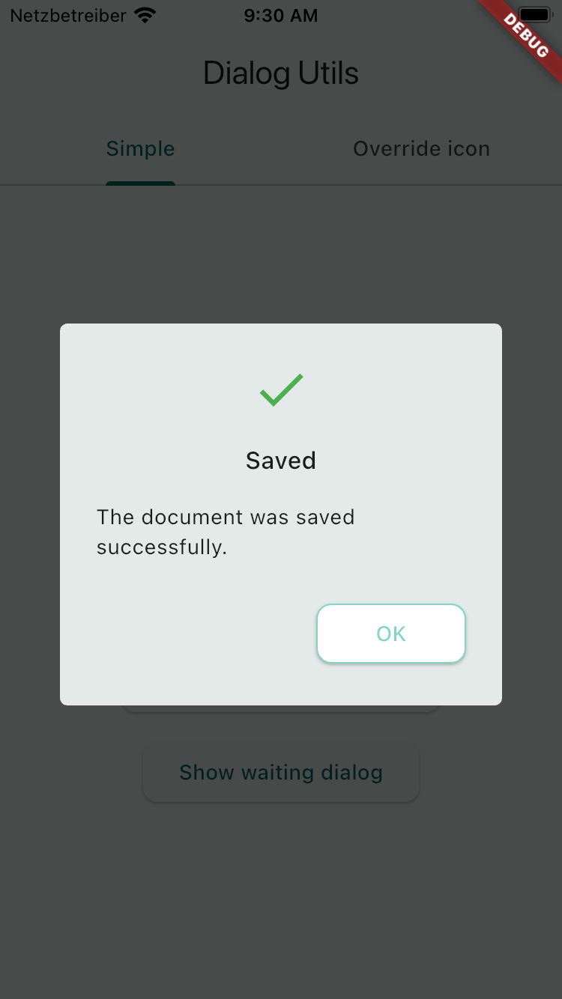
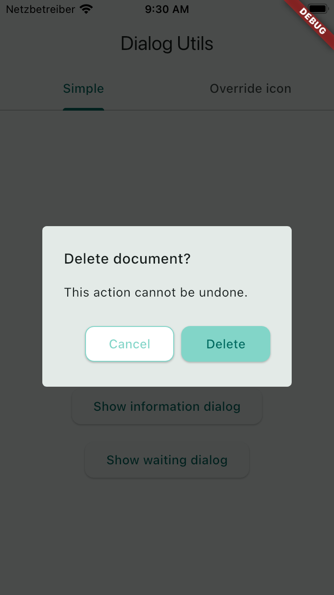
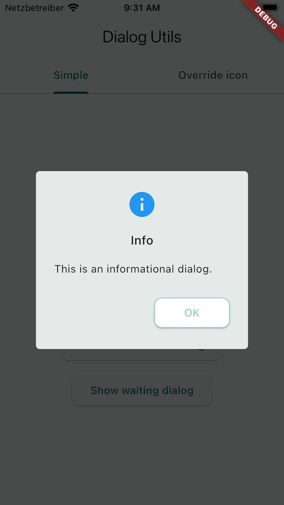
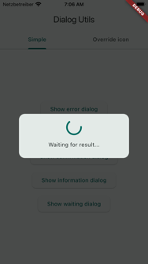

# dialog_utils

Reusable Flutter dialogs with application-wide theme support and overridable
styles and icons.

## Features

- Error, success, confirmation, information, and waiting dialogs
- `DialogUtilsStyle` integration with `ThemeData.extensions`
- Configurable text styles, colors, icon sizes, button sizes, shape, and barrier opacity
- Subclass hooks for replacing styles and icon widgets
- A reusable `DialogUtils()` factory instance

## Installation

Add the package to `pubspec.yaml`:

```yaml
dependencies:
  dialog_utils: ^0.0.1
```

Then run `flutter pub get` and import the public entrypoint:

```dart
import 'package:dialog_utils/dialog_utils.dart';
```

## Theming

`DialogUtilsStyle` is a Flutter `ThemeExtension`. Declare it alongside standard
Flutter theme configuration. The reusable `DialogUtils()` instance reads the
nearest style from the `BuildContext` when a dialog is shown. If the theme has
no `DialogUtilsStyle` extension, the constructor defaults on `DialogUtilsStyle`
are used.

```dart
MaterialApp(
  theme: ThemeData(
    extensions: const [
      DialogUtilsStyle(
        titleTextStyle: TextStyle(fontSize: 22),
        contentTextStyle: TextStyle(fontSize: 17),
        errorIconColor: Colors.deepOrange,
        iconSize: 48,
        dialogRadius: 16,
        buttonMinimumSize: Size(120, 50),
      ),
    ],
    elevatedButtonTheme: ElevatedButtonThemeData(
      style: ElevatedButton.styleFrom(
        minimumSize: Size(120, 50),
      ),
    ),
  ),
  home: Builder(
    builder: (context) => ElevatedButton(
      onPressed: () => DialogUtils().showErrorDlg(
        context,
        title: 'Unable to save',
        content: 'Please try again.',
      ),
      child: const Text('Show dialog'),
    ),
  ),
);
```

## Custom Icons And Styles

Subclass `DialogUtils` and override any style method, icon method, or dialog
method. Icon hooks return `Widget`, so they can return an `Icon` or a
completely custom widget. Use `DialogUtils.withStyle` for an independent
instance instead of the shared factory instance.

```dart
class AppDialogUtils extends DialogUtils {
  const AppDialogUtils() : super.withStyle();

  @override
  Widget errorIcon(BuildContext context) {
    return const Icon(Icons.warning_amber_rounded, size: 48);
  }

  @override
  ButtonStyle primaryButtonStyle(BuildContext context) {
    return ElevatedButton.styleFrom(
      backgroundColor: Colors.teal,
      foregroundColor: Colors.white,
    );
  }
}

Builder(
  builder: (context) => ElevatedButton(
    onPressed: () => const AppDialogUtils().showErrorDlg(
      context,
      title: 'Unable to save',
      content: 'Please try again.',
    ),
    child: const Text('Show dialog'),
  ),
);
```

The built-in override points are `dialogTitleStyle`, `dialogContentStyle`,
`dialogButtonTextStyle`, `defaultButtonStyle`, `primaryButtonStyle`,
`errorIcon`, `successIcon`, `infoIcon`, `dialogBarrierColor`, `dialogShape`,
`showErrorDlg`, `showSuccessDlg`, `showConfirmDlg`, `showInfoDlg`, and
`showWaitingDlg`.

## Available Dialogs

- `showErrorDlg` shows an error with OK and optional cancel actions.
- `showSuccessDlg` shows a success message with OK and optional cancel actions.
- `showConfirmDlg` shows cancel and confirm actions and returns the choice.
- `showInfoDlg` shows an informational message with OK and optional cancel actions.
- `showWaitingDlg` displays progress while an asynchronous `FutureResult` runs.

## Example

See the complete runnable application in
[`example/lib/main.dart`](example/lib/main.dart). It demonstrates both direct
factory usage and custom icon overrides.

### Screenshots

| Error | Success | Confirm | Info | Waiting |
|---|---|---|---|---|
|  |  |  |  |  |

## License

See [LICENSE](LICENSE).